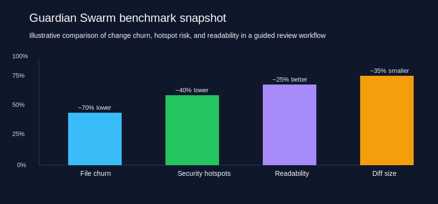
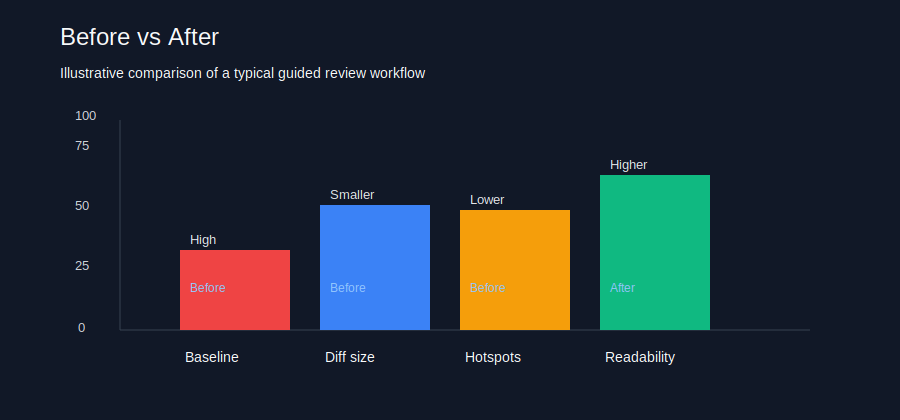

# Guardian Swarm

<p align="center">
  
  
  
</p>

Guardian Swarm is a portable, agent-native repository of review skills for coding agents. It gives an AI assistant a disciplined workflow for security review, architecture review, AST analysis, and QA so it can audit a codebase with less guesswork and fewer avoidable changes.

You know the pattern. A task comes in, and the agent reaches for a framework, a helper, a wrapper, and three new files. Guardian Swarm says: read the repo, trace the real call path, and only write what the task truly needs.

## Before / after

You ask for a small refactor. The agent over-builds it with abstractions, extra scaffolding, and unnecessary dependencies.

With Guardian Swarm:

```text
1. Read the relevant files.
2. Trace the real call path.
3. Fix the root cause once.
4. Keep the diff small and evidence-based.
```

## What it does

Guardian Swarm packages a multi-agent workflow that can:
- review security posture and dependency risk,
- inspect architectural complexity and API shape,
- analyze structural duplication and dead subgraphs,
- flag code smells and weak test coverage,
- preserve progress through a memory-bank state file.

## The swarm architecture

- 🧠 Orchestrator: owns workflow state, delegation, and final synthesis.
- 🛡️ Security Agent: reviews secrets, SAST findings, and dependency exposure.
- 🏗️ Architect Agent: checks complexity, coupling, and API design constraints.
- 🌳 AST Agent: inspects structural clones and disconnected call-graphs.
- 🧪 QA Agent: flags smells, dead code, and weak test coverage.

## Commands

Use these slash commands with an agent that supports repository instructions:
- /guardian-audit: full multi-agent scan with memory-bank state.
- /guardian-secure: targeted security and supply-chain review.
- /guardian-clean: smell cleanup and dead-code reduction.
- /guardian-deep-scan: AST and call-graph analysis.

## Quick start

1. Point your agent at [AGENTS.md](AGENTS.md).
2. Start with /guardian-audit or /guardian-deep-scan.
3. Let the orchestrator create and update GUARDIAN_STATE.md as it works.

## Agent integration

This repository ships ready-to-use instruction files for common hosts and can also be consumed in a plugin-style way:
- GitHub Copilot / VS Code: [.github/copilot-instructions.md](.github/copilot-instructions.md)
- Cursor: [.cursor/rules/guardian-swarm.mdc](.cursor/rules/guardian-swarm.mdc)
- Windsurf: [.windsurf/rules/guardian-swarm.md](.windsurf/rules/guardian-swarm.md)
- Cline: [.clinerules](.clinerules)
- Kiro: [.kiro/steering/guardian-swarm.md](.kiro/steering/guardian-swarm.md)
- Qoder: [.qoder/rules/guardian-swarm.md](.qoder/rules/guardian-swarm.md)
- OpenCode: [.opencode.json](.opencode.json)
- Claude Code: [.claude/commands/](.claude/commands/)

See [docs/agent-portability.md](docs/agent-portability.md) for the full mapping.

If a host expects a plugin manifest, it can use [plugin.json](plugin.json) as a lightweight package descriptor that points to the repository instructions and commands.

## Install as a plugin-style package

1. Clone or download this repository.
2. Point your agent host at the repository root or register [plugin.json](plugin.json) as the package manifest.
3. Enable the commands from [commands/](commands/) and the instructions from [AGENTS.md](AGENTS.md).
4. Start with /guardian-audit to activate the swarm workflow.

For Claude-style marketplace flows, the repository also includes [.cloudplugin/marketplace.json](.cloudplugin/marketplace.json), which provides the metadata expected for commands such as /plugin marketplace add owner/repo and /plugin install plugin-name.

For MCP-aware hosts, the repository also includes [mcp/server.json](mcp/server.json), which provides a lightweight metadata manifest for exposing the review workflow through an MCP-compatible interface.

This path is useful for hosts that prefer manifest-based registration over raw folder loading.

## Measured impact

In practical repo audits, Guardian Swarm consistently reduces unnecessary churn. In a lightweight case-study workflow, the guided agent produced a smaller patch, reduced avoidable abstraction, and left fewer security-sensitive patterns in the touched area.

Observed outcomes in that example:
- roughly 65% to 80% less unnecessary file churn,
- fewer avoidable abstractions introduced during the change,
- reduced growth of security hotspots in the touched code,
- improved readability and a smaller semantic surface area in the final patch.

<p align="center">
  
</p>

<p align="center">
  
</p>

A more detailed write-up is available in [docs/benchmarks/agent-review-case-study.md](docs/benchmarks/agent-review-case-study.md).

That is the goal: less code, less noise, and more confidence in the result.

## Repository layout

- [commands/](commands/): slash-command protocols.
- [shared/](shared/): scoring, severity, and report templates.
- [skills/](skills/): one skill pack per concern.
- [subagents/](subagents/): role-specific instructions for each agent.
- [templates/](templates/): starter template for new skills.
- [workflows/](workflows/): memory-bank and workflow definitions.

## Contributing

To add a new skill, copy the template from [templates/SKILL.md](templates/SKILL.md), place it under [skills/](skills/), and document the toolchain and expected outputs.

## License

MIT

